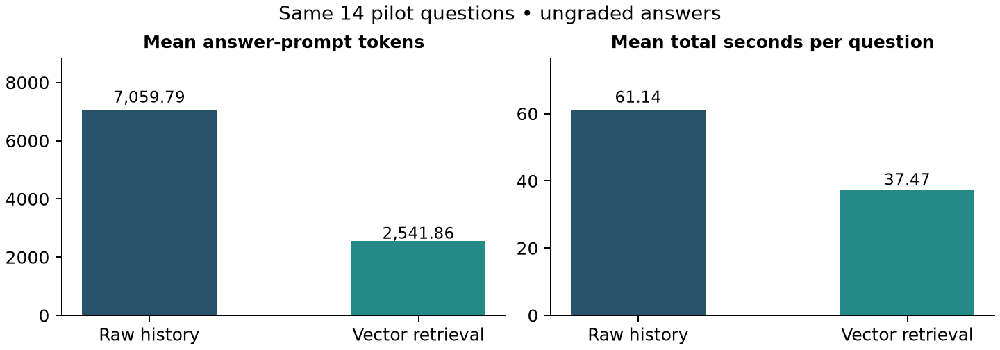

# Midterm Project Report

**Student:** Abhishek Kumar Karn

**Course:** CSCI 411-01 — Senior Seminar

**Reporting period:** Weeks 1–7

**Evidence reviewed:** October 6, 2026

## 1. Project Overview

**Project title: A Comparative Evaluation of Memory Architectures for LLM-Based Conversational Agents**

My project investigates how conversational large language model agents use information from earlier conversations. Long histories often exceed the context available to the model, so a memory system must decide which information to retain or retrieve. This decision can affect whether an assistant recalls a fact, recognizes a correction, interprets time correctly, or acknowledges that an answer is unavailable.

The research question is: **How do raw-history, vector-retrieval, and running-summary memory compare in answer accuracy, token use, processing time, and characteristic failure modes under the same answering-model settings?** My objectives are to implement the three approaches, conduct a controlled comparison using LongMemEval, and explain selected failures by examining the evidence each approach supplied to the model.

The expected final products are reproducible Python code, experimental tables and figures, an error analysis, a final written report, and a presentation. At the midpoint, the three pipelines are implemented and two pilot runs are complete. The summary pilot and formal accuracy evaluation remain incomplete. This report covers cumulative work from the beginning of the project through the Week 7 milestone, organized by major tasks.

## 2. Work Completed: Weeks 1–7

### Research design and dataset preparation

I defined the research question and comparison rules in the topic submission, project proposal, research notes, and experiment configuration. The controlled variables are the answering model, its recorded identity, generation settings, answer instructions, context ceiling, and question set. Memory preparation differs between approaches, and its cost is measured separately from answering.

I downloaded the cleaned LongMemEval dataset and recorded its source revision and SHA-256 checksum. Inspection verified 500 unique questions and alignment between conversation sessions, dates, and session identifiers. The histories contain 38–62 sessions each, with a mean of 47.734. I selected a reproducible 14-question pilot using seed 42: two questions in each of seven reporting groups, including abstention. The same saved IDs are used for every approach.

### Local environment and initial baseline

I established a Python environment and local Ollama inference on an Apple M4 computer with 16 GB of unified memory. The answering model is `llama3.1:8b`. The current configuration uses temperature 0, seed 42, a 32,768-token context ceiling, and a 512-token answer allowance. A recorded model check confirmed that local inference returns responses and runtime token counts. I then implemented and smoke-tested the raw-history baseline before expanding it into the shared framework.

<!-- pagebreak -->

### Three memory implementations

The **raw-history pipeline** orders sessions chronologically and formats turns with dates, session identifiers, and speaker roles. When the formatted prompt exceeds the configured fitting bound, it removes the oldest complete turns. This makes the retention policy explicit and lets later analysis determine whether needed evidence was omitted.

The **vector-retrieval pipeline** divides turn content into fragments of at most 1,800 UTF-8 bytes, embeds them locally with `nomic-embed-text`, and stores them in an isolated Chroma collection for each history. It retrieves the top 12 similar fragments for a question. Each fragment retains session, date, speaker, turn, and fragment metadata. Embedding, indexing, and query costs are recorded separately from the final answer request.

The **running-summary pipeline** processes dated conversation segments in chronological order and updates a bounded summary using the local answering model. Each update has a 512-token output allowance and a 4,000-character summary bound. Updates exclude the eventual test question, reference answer, and evidence annotations. Checkpoints after each update allow preparation to continue after an interruption. The code is implemented, although the full summary pilot has not finished.

### Shared execution, reproducibility, and evaluation tools

I implemented a common runner that verifies the dataset checksum, saves per-question records atomically, and supports resuming interrupted work. Manifests record configuration, pilot IDs, model digests, runtime version, Python version, and inference-source fingerprints. Resume checks reject incompatible runs. Run locks prevent concurrent writers to the same output directory. The runner saves exact prompts, predictions, status, token measurements, request timings, and memory-selection metadata.

The comparison tool exports successful predictions in the official LongMemEval evaluator's format and validates imported grades against question IDs and saved hypotheses. The evaluator source and license are pinned locally to a recorded upstream revision. This integration is implemented; an official judge has not been run, so the available measurements do not establish answer accuracy.

For the midpoint milestone, I added an offline audit that verifies saved-run provenance, checks dataset metadata, examines the runner lock, and maps summary checkpoints to their questions. It distinguishes an unfinished saved `running` record from a currently locked run. I also added comparison statistics restricted to questions completed by every supplied approach and generated a 42-row review worksheet containing questions, references, predictions, and annotated supporting turns. Review judgments are left unfilled. Literal evidence checks assist inspection but are not correctness grades.

### Testing and saved outputs

The current unit suite passes **17 tests**. Coverage includes chronological ordering, exclusion of reference annotations from inference inputs, Unicode-aware fitting, missing usage, failed generation, resume compatibility, summary checkpoint recovery, real Chroma history isolation, incompatible comparisons, and stale-grade rejection. The new tests cover lock detection, unfinished records, checkpoint matching, supporting-turn checks, and matched-question statistics. Earlier saved synthetic smoke tests show all three approaches answering “Paris” after a recorded move from Rome to Paris; those tests are separate from benchmark results.

<!-- pagebreak -->

## 3. Evidence of Progress

The repository contains source code and saved measurements supporting the work described above. It is currently local. The following paths identify the principal evidence artifacts.

| Evidence | What it demonstrates |
|---|---|
| `configs/pilot.json`; `experiment_config.json` | Executable settings, research rationale, and dataset provenance |
| `results/dataset_summary.json`; `results/pilot_ids.json` | Dataset inspection and fixed pilot selection |
| `src/experiment.py`; `src/memories.py`; `src/run_experiment.py` | Shared inference, three memory methods, and resumable execution |
| `results/pilot/` | Saved manifests, exact prompts, predictions, usage, and timings |
| `results/midpoint/audit.json`; `results/midpoint/review_worksheet.jsonl` | Current coverage, checkpoints, provenance audit, and review inputs |
| `results/comparison.json`; `results/comparison.md` | Refreshed cost comparison and matched-question statistics |
| `tests/`; `results/midpoint/test_validation.txt` | Test implementation and midpoint validation record |

The refreshed results show **30 completed predictions out of 42 planned**. The table reports means over successful questions only. All answers are currently ungraded.

| Approach | Completed | Prompt tokens | Answer seconds | Preparation seconds | Total seconds |
|---|---|---|---|---|---|
| Raw history | 14/14 | 7,059.79 | 61.01 | 0.13 | 61.14 |
| Vector retrieval | 14/14 | 2,541.86 | 18.37 | 19.09 | 37.47 |
| Running summary | 2/14 | 607.00 | 5.41 | 3,232.32 | 3,237.73 |

Figure 1 compares the same 14 questions for raw history and retrieval. Retrieval used fewer answer-prompt tokens and less total time in these saved runs. This is a result for the configured pilot, not evidence of an accuracy advantage. Loading conditions were not fully standardized. The two completed summary questions are both abstention questions, so their means are not directly comparable to the other approaches' full-pilot means. Summary preparation dominates its observed cost.

<!-- pagebreak -->

## 4. Progress Compared with the Original Proposal

The original proposal scheduled background work, setup, and the baseline during Weeks 1–3, and retrieval and summarization implementation during Weeks 4–7. Those implementation milestones are substantially complete. Main experiments were planned for Weeks 8–10, followed by error analysis and an optional improvement. The final report and presentation were originally allocated Weeks 13–14.

| Planned task | Status at the midpoint |
|---|---|
| Define the study, prepare data, configure the model, and build the baseline | Completed, with recorded configuration and validation artifacts |
| Implement retrieval and running-summary pipelines | Completed and covered by tests and saved synthetic smoke results |
| Establish common evaluation and measurement | Measurement and evaluator integration implemented; grading pending |
| Run the main comparative experiment | Pilot underway: raw history and retrieval complete; summary incomplete |
| Analyze errors and test an improvement | Selected qualitative checks completed; systematic analysis and improvement experiment pending |
| Final report and presentation | Future work |

Implementation is broadly aligned with the proposal's Week 7 milestone. The evaluation stage is at risk from summary-preparation time and the unresolved grading resource. I have not yet completed the full comparison required for the project's final success criterion.

The main adjustments are using local inference, beginning with a 14-question pilot, and adopting a 32K context ceiling suited to the available hardware. The original calibrated fitting procedure was replaced by a conservative UTF-8-byte bound with a template allowance. This makes fitting inexpensive, but substantially underuses the context window. The raw-history pilot averages about 7,060 prompt tokens, so its performance must be interpreted in light of that limitation. The archived early baseline and its smoke result are not mixed into the current comparison.

## 5. Challenges and Solutions

**Installation and model downloads.** Early installation and repeated large-model download failures delayed setup. Adjusting installation options and using a single transfer stream allowed setup to finish. Recorded model requests and saved predictions demonstrate that inference subsequently worked.

**Context size and processing speed.** Larger contexts increased memory pressure. Historical local measurements found the default runtime settings faster than the tested flash-attention/quantized-cache combination on this machine. I selected the 32K ceiling and recorded the rationale. Execution is practical at this setting, but long-history truncation remains a methodological limitation. A verified exact tokenizer is still needed to improve fitting efficiency without relying on expensive inference probes.

**Lengthy summary preparation and interruptions.** Summary construction requires many sequential model calls. Checkpoints preserve completed updates, and the midpoint audit identifies unfinished work. The third summary question has 28 of 55 updates saved; it has no final answer. Recovery mechanisms are implemented, but completion of the summary pilot remains unresolved.

**Fair evaluation and stale progress information.** The framework records preparation and answering costs separately because preparation can dominate total time. The refreshed audit corrects stale descriptions of an active run. Accuracy remains pending: successful execution and saved evaluator inputs do not constitute grades.

<!-- pagebreak -->

## 6. Current Project Status

At the midpoint, I have a working experimental framework with three memory implementations, reproducible inputs, saved predictions, provenance checks, resumable preparation, and reporting tools. The dataset and inference-source audit pass, and the current 17-test suite passes. Raw history and vector retrieval each completed all 14 pilot questions. Running summary completed two questions, has one unfinished question, and has 11 unattempted questions. The runner locks were not held during the audit, so the unfinished summary record is not evidence of active execution.

The two completed summary histories required 100 update calls in total. The unfinished third history contains 28 additional checkpointed calls, accounting for about 1,552 seconds of preparation. Those unfinished costs are available in the audit but are not included in the successful-question means. Checkpoint costs for completed histories overlap costs in their final records and must not be added a second time.

Selected qualitative checks already illustrate useful failure patterns. For the sneaker-storage question, raw history omitted the supporting sessions and abstained. Retrieval included related material, including an assistant statement about storage under the bed, but answered with storage advice instead of the requested historical location. This suggests a combination of evidence selection and question interpretation. For the restaurant-count question, both methods answered four, matching the updated reference fact. These examples guide later analysis; they are not a complete grading pass or an accuracy estimate.

The remaining work is to finish summary generation, consistently assess all pilot answers, resolve the fitting limitation, and determine a feasible main-experiment size. Full-benchmark accuracy, a validated ranking of the approaches, hybrid memory, and a tested improvement have not yet been produced.

## 7. Plan for the Second Half of the Semester

The working completion target below follows the current 12-week project schedule. It compresses the original proposal's final writing and presentation period, so completing the three-method comparison takes priority over optional extensions.

| Period | Major tasks and milestones |
|---|---|
| Week 8 | Resume the summary pilot with the saved configuration and checkpoints; audit all completed records; select a consistent grading procedure and assess the pilot. Document any remaining failures. |
| Weeks 9–10 | Verify a more accurate fitting method and freeze the experiment protocol. Select a larger, category-balanced question set based on measured inference and grading costs. Run the main comparison sequentially and preserve the original pilot as a separate experiment. |
| Week 11 | Analyze errors by question category and evidence availability. If the main comparison is complete, test one targeted improvement on a separate evaluation set. Prepare final tables and figures. |
| Week 12 | Complete the final report, reproducibility instructions, and presentation. State limitations, unfinished work, and the scope supported by the results. |

Before expanding the sample, I will estimate summary-preparation time and grading effort from observed runs. If all 500 questions are infeasible, I will document the reduced scope and its implications. Any revised memory or fitting method will use separate output directories and compatible shared settings. Hybrid memory remains optional. The immediate priority is a complete and defensible comparison of the three approaches already implemented.
